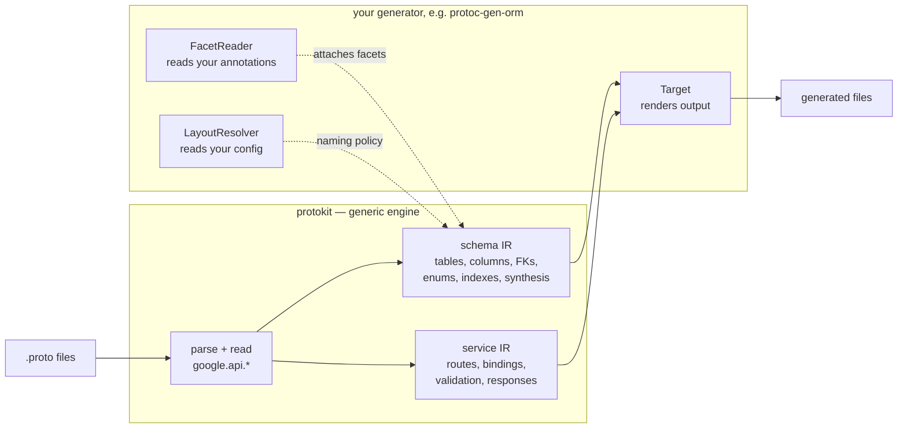
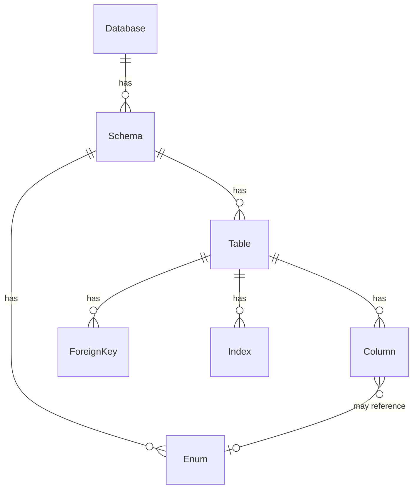
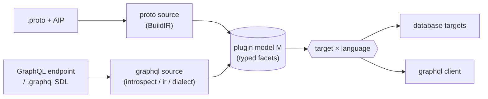

# Protokit

**A generic toolkit for building code generators.**

Its core does the hard, backend-agnostic 80% of a generator's frontend — parsing
the descriptor set, reading the [Google AIP](https://google.aip.dev/)
annotations, and building a normalized intermediate representation (IR) — so a
generator only has to supply the 20% that is actually specific to its target: how
to read its own options and how to render.

There are two such frontends, both AIP-native, both target-agnostic:

- **the schema IR** (`protokit`, `schema`) — `google.api.resource` /
  `field_behavior` / `resource_reference` in; databases, tables, columns,
  relations, enums and indexes out. It answers *what does this API store*.
- **the service IR** (`service`) — `google.api.http` in; a route table out, with
  path/body/query binding, AIP method classification, per-binding validation
  rules and status sets. It answers *what HTTP surface does this API declare,
  and what does each request mean*.

Beyond those it provides the pieces a generator needs to grow past "one proto
source, one output": a **source-agnostic [factory](#beyond-proto--sources-targets-and-languages)**
(generic `Source`/`Target`/`Registry` over a plugin-defined model, so a plugin can
add non-proto sources and multiple output languages), a **[GraphQL frontend](#beyond-proto--sources-targets-and-languages)**
(introspection/SDL → IR → typed client), and shared Go-emit helpers — all reused
across every target instead of re-implemented per plugin.

It ships **no binary and no proto module**. It reads AIP and nothing else; every
annotation vocabulary — including the neutral one that decides what things are
*named* — arrives through a reader the plugin registers. Generators import
protokit.



## Why

Writing a `protoc` plugin that emits a database schema, an on-chain contract, or
any other model artifact means re-implementing the same frontend every time:
walk the descriptors, honor AIP, group messages into a schema tree, resolve
foreign keys, synthesize surrogate keys and audit timestamps, name and validate
indexes, and template it all out with reproducible banners and golden tests.

A plugin that emits an HTTP surface re-implements a second one: the
`google.api.http` template grammar, path capture against the request message,
`body: "*"` versus a named body, the query parameters that are whatever is left
over — and, usually, never an answer to whether two routes can match the same
request, which is then settled by registration order at request time.

protokit implements both once, generically, and exposes a few small interfaces.
Your generator stays focused on its target; two generators built on protokit
(a database one and a blockchain one) share the IR and — enforced by a test —
derive the same names from the same protos.

## The neutral vocabulary: `entity.v1`

Two generators over one set of protos must agree on what a table is called. That
agreement comes from a vocabulary neither of them owns alone — `entity.v1` — which
expresses exactly the structure deciding **what things are named and which of them
exist**, and nothing storage-specific. A Solidity generator and a Postgres
generator must agree on a table name; they have no shared opinion about
`VARCHAR(500)`.

```proto
option (entity.v1.datasource) = {database: "bookstore_db" schema: "bookstore"};

message Author {
  option (google.api.resource) = {type: "bookstore.v1/Author" …};
  option (entity.v1.table) = {id: ID_STRATEGY_ULID, timestamps: true};

  string internal_notes = 4 [(entity.v1.column) = {skip: true}];
}
```

**It does not live here.** It lives in store, published as
`buf.build/the-protobuf-project/entity`, with the reader over it shipped as the
nested module `github.com/the-protobuf-project/store/entity` — which imports
protokit and nothing else from store, so any plugin can consume it without pulling
a database generator along with it.

That is the opposite of the obvious arrangement, and it was arrived at the hard
way: protokit did own this vocabulary, as `protokit.v1`, until the persistence
shape of it (`datasource`, `table`, `column`, `id_strategy`) made the neutral
engine a persistence engine with a generic name. web3 has no datasources. What
makes two plugins agree is that they run **the same reader**, not that protokit
adjudicates. See [docs/ownership.md](docs/ownership.md).

## The extension points

A generator on the schema path supplies **facet readers** (its own annotations),
an optional **layout resolver** (its own config), and **targets** (rendering):

```go
// FacetReader carries your annotation package into the IR — as side-tables keyed
// by node, never as fields on the IR. protokit imports none of it.
type FacetReader interface {
    Key() string                                          // "orm.v1"
    ReadFile(protoreflect.FileDescriptor) (any, error)
    ReadMessage(protoreflect.MessageDescriptor) (any, error)
    ReadField(protoreflect.FieldDescriptor) (any, error)
}

// LayoutResolver is the naming policy you resolve from your own config file.
type LayoutResolver interface {
    ResolveDatasource(pkg string) (database, schema string, stripVersion, ok bool)
    DedupeSchemaTable() bool
}

// Target renders the finished IR.
type Target interface {
    Name() string                                       // "gorm", "solidity", …
    Generate(p *protogen.Plugin, dbs []*Database) error
}

// IRTarget is a Target that also wants the facets.
type IRTarget interface {
    Target
    GenerateIR(p *protogen.Plugin, ir *IR) error
}
```

Wire them into a `main`:

```go
protokit.RunPlugin(p, opts, protokit.Plugin{
    Registry: map[string]schema.Target{"sql": &sqlTarget{}},
    Readers:  []protokit.FacetReader{myReader{}},
    Layout:   myLayout,
})
```

protokit reads AIP itself, collects each reader's facets, runs any enrichment,
finalizes indexes, then hands the IR to the selected target.
Registration is explicit at `RunPlugin` — there is no global registry and no
`init()`, so a run sees exactly what its caller passed.

Read a facet back by node:

```go
opts, ok := protokit.Facet[*ColumnFacet](ir, "orm.v1", col.Node)
```

`col.Node` is a `NodeID` — the fully-qualified proto name, always derived from the
descriptor. Never from `Table.Name` or `Column.Name`: those are outputs, and a
table rename must not orphan a facet lookup.

Two optional interfaces exist for a reader that must influence the build rather
than merely annotate it — `StructureReader` (the neutral vocabulary itself, a
deprecated one being migrated off, or the referential actions no vocabulary
expresses) and `Enricher` (constraints the index pass reads). Each doc comment
explains why it is unavoidable.

> **Migrating from `schema.Backend`?** It still works — protokit adapts it
> internally — and `Run`/`BuildIR` keep their signatures. Both are deprecated;
> see [`schema/backend.go`](schema/backend.go) for the mapping.

## Two plugins, one set of names

The property all of the above exists to protect:

```go
golden.IRAgreement(t, caseDir, pluginA, pluginB)
```

Builds the IR under both plugins' readers and asserts identical database, schema,
table, and column names plus primary- and foreign-key resolution, naming the
diverging `NodeID` on failure. Before a shared neutral vocabulary, each generator
resolved those names from its own annotations and its own config, so a second
generator over the same protos silently disagreed. This is the test that keeps
that from coming back — and, since protokit no longer reads the vocabulary itself,
it is also what catches a plugin that wrote its own `entity.v1` reader instead of
importing the shipped one.

Its companion, `golden.Determinism(t, caseDir, plugin)`, generates twice and
byte-compares — catching the map-ranged-into-output bug that a committed golden
file cannot.

## The schema IR

The schema IR is a plain tree with **neutral, target-agnostic types** — no SQL, no
Solidity. Each generator projects `Column.Type` (a `schema.FieldType`) onto its
own type system.



## The service IR

`service` is the RPC counterpart. Descriptors in, routes out — a separate entry
point, not part of the facet/target machinery above:

```go
ir, err := service.Build(plugin, service.Options{
    Domain: "library.example.com",     // the AIP-193 ErrorInfo domain; protos declare none
    Strict: "route:error,aip:warn",    // per-rule severity for recoverable problems
})
```

Everything that requires understanding protobuf happens here, at build time. A
generator consuming this IR emits a route table; a runtime executing that table
parses no templates, reads no descriptors, and resolves no field paths. That
split is what lets several runtimes in different languages agree on what a
request means — none of them decides it.

Per binding, the IR carries:

- **Path, body and query.** Every template capture resolved against the input
  message; `body: "*"`, a named body, or `google.api.HttpBody` passthrough; and
  the query parameters that are left over, subtracted here so no runtime does it
  reflectively. Each resolved path carries both spellings — `book.display_name`
  for a generator emitting accessors, `book.displayName` for the wire, the
  `FieldViolation`, and the OpenAPI document.
- **A method pattern.** AIP-131–136 plus the batch methods (AIP-231–235),
  classified by name and then checked against the shape that name implies, so a
  `GetBook` carrying a body is not silently treated as a Get. `Mutating` is
  derived from the pattern, so a middleware selector written against it stays
  correct when a method is added.
- **Validation rules.** `field_behavior` (`REQUIRED`, `OUTPUT_ONLY`, `IMMUTABLE`,
  `IDENTIFIER`), resource-name patterns, `field_info` formats, and protovalidate
  constraints — folded to constant checks where possible, flagged as needing a
  CEL evaluator where not, rather than dropped.
- **A status set.** The responses a binding can actually produce, not `200` and a
  `default`: `400` where it binds anything, `401`/`403` where the service
  declares `oauth_scopes`, `404` where it names a resource.
- **Proto-granular field kinds.** `service.Kind` keeps distinctions
  `schema.FieldType` folds for a database: the four 64-bit widths are one type
  there, but protojson encodes every one of them as a string while the 32-bit
  widths stay numbers, and a codec that gets that wrong loses precision silently.

Alongside them it indexes every reachable message and enum, and every AIP-123
resource by type — patterns, `singular`/`plural`, name field — which is what lets
an opaque `{name=shelves/*/books/*}` capture become a navigable
`/v1/shelves/{shelf}/books/{book}` in an OpenAPI document.

**An ambiguous route table fails the build.** `service/httprule` holds the
path-template grammar, the opcode compiler, and a `Conflicts` analysis run
exhaustively over the whole route set — naming both bindings and an example path
that matches each. No single method can see that set, so the check can only
happen here; grpc-gateway settles the same overlap by registration order, at
request time, with no report either way. A route that is merely shadowed is legal
and is reported as a diagnostic instead.

## Beyond proto — sources, targets, and languages

The proto path above (`Backend` + `schema.Target`, driven by `Run`) is the original
core. On top of it, protokit provides a **source-agnostic factory** so a generator can
have more than one input and more than one output language, sharing the orchestration:

```go
// factory — generic over the plugin's model type M.
type Source[M any] interface { Name() string; Build(Ctx) (M, error) }
type Target[M any] interface { Name() string; Languages() []string; Generate(Ctx, M, string) error }
type Registry[M any] struct { Sources map[string]Source[M]; Targets map[string]Target[M] }
```

A generator keeps its own richly-typed model `M` (e.g. one carrying a proto-schema
facet *and* a GraphQL facet); protokit stays free of that model. A **proto source**
wraps `BuildIR`; the DB `schema.Target`s are adapted into `factory.Target[M]`; and the
**GraphQL frontend** (`graphql/introspect` + `graphql/ir` + `graphql/dialect`) is a
second source that turns an endpoint or a `.graphql` SDL file into the IR a client
target renders:



The parsing is language-agnostic; a target's language-specific templates sit under a
per-language folder, so adding Python/TypeScript output is a new template set over the
same model. [orm](https://github.com/the-protobuf-project/orm) is the reference
consumer of all of this (proto → GORM/SQL/Prisma, plus GraphQL → a typed Go client).

## Packages

| Package | Role |
| --- | --- |
| `protokit` (root) | The schema frontend: `BuildIR`, `Run`, descriptor traversal, grouping, synthesis, relation + index resolution, diagnostics, `protokit.yaml` layout config. |
| `schema` | The schema IR types + the `Backend` and `Target` service-provider interfaces + the neutral `FieldType`. |
| `service` | **The service IR.** `service.Build` turns descriptors into services, methods and HTTP bindings: AIP method classification, path/body/query binding, validation rules, per-binding status sets, resource and message indexes, and proto-granular `Kind`s. |
| `service/httprule` | The `google.api.http` path-template grammar: `Parse` → `Compile` → `Route`, matching and segment decoding, `SortBySpecificity`, and the `Conflicts`/`Shadowed` analysis that makes an ambiguous route table a build failure. |
| `types` | Generic type utilities: `ClassifyField` (proto → neutral type), `Relationalizable`, `ParseProvider`. |
| `naming` | snake/Camel/Pascal, pluralization, identifier sanitizing, **plus Go-emit helpers**: `Doc` (render a description as doc comments), `GoFileName` (safe lowercase file names, build-constraint-guarded), `Unique` (numeric-suffix dedup), `GoKeyword`. |
| `factory` | **Source-agnostic co-generation.** Generic `Source[M]` / `Target[M]` / `Registry[M]` over a plugin-defined model `M`, plus a `Ctx` and a language axis — so one binary drives many sources and targets from one config. |
| `graphql` | **A GraphQL frontend** (parallel to the proto core). `introspect` fetches/decodes introspection JSON and parses `.graphql` SDL; `ir` normalizes it into a GraphQL IR; `dialect` abstracts engine conventions (Hasura built-in). Depends on [gqlparser](https://github.com/vektah/gqlparser). |
| `header` | The reproducible "Code generated by …" banner. `SetTool` names the binary and derives the project link from it; `SetProject` overrides that link where a repository is not named after its generator (`protoc-gen-http` lives in `grpc-gateway-rs`), so a rename cannot leave a dead URL in every generated file. |
| `manifest` | The file a plugin ships to declare itself: the vocabulary it provides, the modules and facets it needs, the outputs it writes. Schema and validation only — it parses and checks a declaration, and deliberately resolves nothing. |
| `docs` | Mermaid ER diagrams + per-model README rendering (the type column comes from a generator-supplied projector). |
| `templates` | A thin `text/template` render helper. |
| `golden` | An in-process golden-file test harness (compiles `.proto` with [protocompile](https://github.com/bufbuild/protocompile) — no `protoc`/`buf` on PATH). |

## Who builds on it

- **[orm](https://github.com/the-protobuf-project/orm)** — database schemas (GORM, SQL, Prisma) from `orm.v1` annotations.
- **[web3](https://github.com/the-protobuf-project/web3)** — on-chain artifacts (Solidity contracts, a Graph subgraph) from `web3.v1` annotations.
- **[grpc-gateway-rs](https://github.com/the-protobuf-project/grpc-gateway-rs)** — `protoc-gen-http`: an AIP-native HTTP/JSON surface over the service IR — Rust, Go and Python runtimes plus an OpenAPI document, all from one route table.

Each is a self-contained example of a protokit generator; see their READMEs for
the full pipeline.

## Releasing / consuming

protokit is a Go library — a release is a semver git tag:

```sh
git tag v0.1.0 && git push origin v0.1.0
```

Consumers then `go get github.com/the-protobuf-project/protokit@v0.1.0`.

## License

Apache-2.0.
