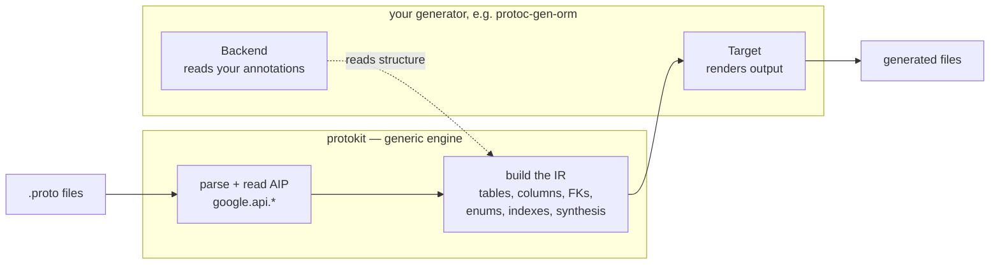
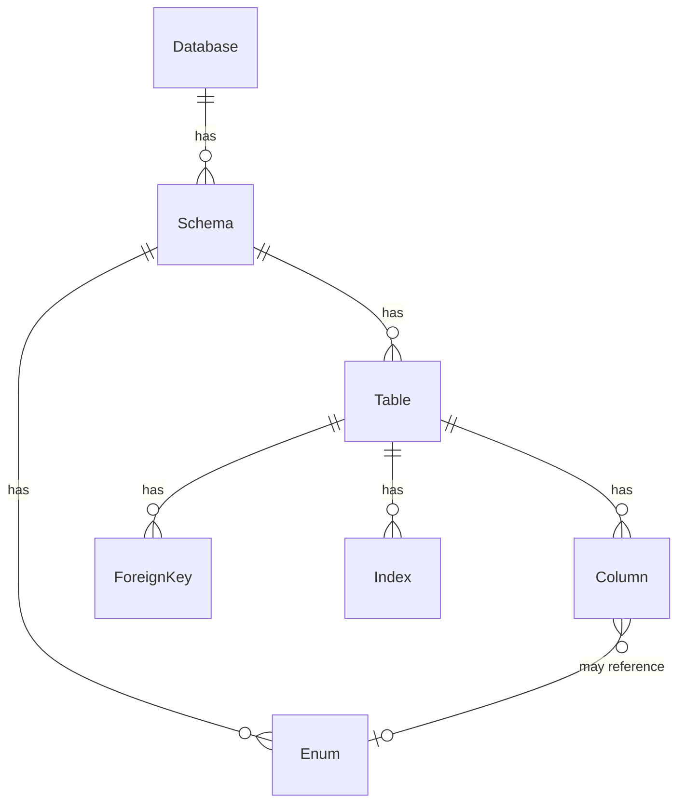
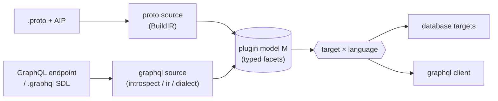

# Protokit

**A generic toolkit for building code generators.**

Its core does the hard, backend-agnostic 80% of a *schema* generator — parsing the
descriptor set, reading the [Google AIP](https://google.aip.dev/) annotations
(`google.api.resource` / `field_behavior` / `resource_reference`), and building a
normalized intermediate representation (IR) of databases, tables, columns,
relations, enums, and indexes — so a generator only has to supply the 20% that is
actually specific to its target: how to read its own options and how to render.

Beyond that proto core it also provides the pieces a generator needs to grow past
"one proto source, one output": a **source-agnostic [factory](#beyond-proto--sources-targets-and-languages)**
(generic `Source`/`Target`/`Registry` over a plugin-defined model, so a plugin can
add non-proto sources and multiple output languages), a **[GraphQL frontend](#beyond-proto--sources-targets-and-languages)**
(introspection/SDL → IR → typed client), and shared Go-emit helpers — all reused
across every target instead of re-implemented per plugin.

It ships **no binary and no user-facing proto options**. Generators import it.



## Why

Writing a `protoc` plugin that emits a database schema, an on-chain contract, or
any other model artifact means re-implementing the same frontend every time:
walk the descriptors, honor AIP, group messages into a schema tree, resolve
foreign keys, synthesize surrogate keys and audit timestamps, name and validate
indexes, and template it all out with reproducible banners and golden tests.

protokit implements that once, generically, and exposes two small interfaces.
Your generator stays focused on its target; two generators built on protokit
(a database one and a blockchain one) share the IR and behave consistently.

## The two extension points

A generator implements **`schema.Backend`** (read *its own* annotation package
into the IR) and **`schema.Target`** (render the IR):

```go
// Backend bridges protokit to your annotation package (protokit imports none).
type Backend interface {
    ReadDatasource(protoreflect.FileDescriptor) Datasource       // grouping
    ReadTable(protoreflect.MessageDescriptor) TableStructure     // name/skip/id/timestamps
    ReadColumn(protoreflect.FieldDescriptor) ColumnStructure     // name/skip/FK actions
    Enrich(dbs []*Database) error                                // fold in your rendering
}

// Target renders the finished IR.
type Target interface {
    Name() string                                       // "gorm", "solidity", …
    Generate(p *protogen.Plugin, dbs []*Database) error
}
```

Wire them into a `main`:

```go
protokit.Run(p, opts, map[string]schema.Target{"sql": &sqlTarget{}}, myBackend{})
```

protokit reads AIP itself, calls the backend's `Read*` methods while building the
IR, runs `Enrich`, finalizes indexes, then hands the IR to the selected target.

## The IR

The IR is a plain tree with **neutral, target-agnostic types** — no SQL, no
Solidity. Each generator projects `Column.Type` (a `schema.FieldType`) onto its
own type system.



## Beyond proto — sources, targets, and languages

The proto path above (`Backend` + `schema.Target`, driven by `Run`) is the original
core. On top of it, protokit provides a **source-agnostic factory** so a generator can
have more than one input and more than one output language, sharing the orchestration:

```go
// factory — generic over the plugin's model type M.
type Source[M any] interface { Name() string; Build(Ctx) (M, error) }
type Target[M any] interface { Name() string; Languages() []string; Generate(Ctx, M, string) error }
type Registry[M any] struct { Sources map[string]Source[M]; Targets map[string]Target[M] }
```

A generator keeps its own richly-typed model `M` (e.g. one carrying a proto-schema
facet *and* a GraphQL facet); protokit stays free of that model. A **proto source**
wraps `BuildIR`; the DB `schema.Target`s are adapted into `factory.Target[M]`; and the
**GraphQL frontend** (`graphql/introspect` + `graphql/ir` + `graphql/dialect`) is a
second source that turns an endpoint or a `.graphql` SDL file into the IR a client
target renders:



The parsing is language-agnostic; a target's language-specific templates sit under a
per-language folder, so adding Python/TypeScript output is a new template set over the
same model. [orm](https://github.com/the-protobuf-project/orm) is the reference
consumer of all of this (proto → GORM/SQL/Prisma, plus GraphQL → a typed Go client).

## Packages

| Package | Role |
| --- | --- |
| `protokit` (root) | The frontend: `BuildIR`, `Run`, descriptor traversal, grouping, synthesis, relation + index resolution, diagnostics, `protokit.yaml` layout config. |
| `schema` | The IR types + the `Backend` and `Target` service-provider interfaces + the neutral `FieldType`. |
| `types` | Generic type utilities: `ClassifyField` (proto → neutral type), `Relationalizable`, `ParseProvider`. |
| `naming` | snake/Camel/Pascal, pluralization, identifier sanitizing, **plus Go-emit helpers**: `Doc` (render a description as doc comments), `GoFileName` (safe lowercase file names, build-constraint-guarded), `Unique` (numeric-suffix dedup), `GoKeyword`. |
| `factory` | **Source-agnostic co-generation.** Generic `Source[M]` / `Target[M]` / `Registry[M]` over a plugin-defined model `M`, plus a `Ctx` and a language axis — so one binary drives many sources and targets from one config. |
| `graphql` | **A GraphQL frontend** (parallel to the proto core). `introspect` fetches/decodes introspection JSON and parses `.graphql` SDL; `ir` normalizes it into a GraphQL IR; `dialect` abstracts engine conventions (Hasura built-in). Depends on [gqlparser](https://github.com/vektah/gqlparser). |
| `header` | The reproducible "Code generated by …" banner. |
| `docs` | Mermaid ER diagrams + per-model README rendering (the type column comes from a generator-supplied projector). |
| `templates` | A thin `text/template` render helper. |
| `golden` | An in-process golden-file test harness (compiles `.proto` with [protocompile](https://github.com/bufbuild/protocompile) — no `protoc`/`buf` on PATH). |

## Who builds on it

- **[orm](https://github.com/the-protobuf-project/orm)** — database schemas (GORM, SQL, Prisma) from `orm.v1` annotations.
- **[web3](https://github.com/the-protobuf-project/web3)** — on-chain artifacts (Solidity contracts, a Graph subgraph) from `web3.v1` annotations.

Each is a self-contained example of a protokit generator; see their READMEs for
the full pipeline.

## Releasing / consuming

protokit is a Go library — a release is a semver git tag:

```sh
git tag v0.1.0 && git push origin v0.1.0
```

Consumers then `go get github.com/the-protobuf-project/protokit@v0.1.0`.

## License

Apache-2.0.
